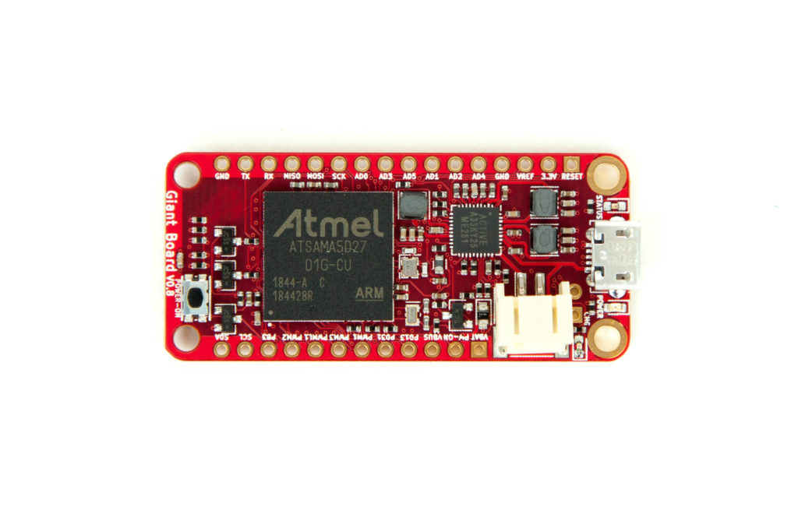

# Giant Board


<br><sup>[Image credit](#groboards)</sup>

| Feature              | Description                     |
| -------------------- | ------------------------------- |
| CPU                  | 500 MHz ARM Cortex-A5           |
| Memory               | 128M DDR2                       |
| Storage              | MicroSD                         |
| Linux kernel         | 5.4                             |
| IEx terminal         | UART ttyS0                      |
| GPIO, I2C, SPI       | Yes - [Elixir Circuits](https://github.com/elixir-circuits) |
| UART                 | ttyS0                           |
| Ethernet             | No                              |
| Video                | No                              |
| Camera Interface     | No                              |

## USB OTG support

One of the goals of this system is to make it possible to do most development
via one USB cable. That cable, when plugged into the USB OTG port, powers the
Giant board and provides local networking. Via the network connection, one
can access an IEx prompt via ssh, transfer files via sftp, run firmware updates,
use Erlang distribution and anything else that works over IP.


When you connect the USB OTG port to your laptop, it should "just" work if
you're using OSX or Linux. If you're on Windows and want to access networking
natively (not through a Linux VM), you will need to install
[`linux.inf`](https://elixir.bootlin.com/linux/v4.19.102/source/Documentation/usb/linux.inf).
This file is unsigned and will fail to install unless you disable signed driver
enforcement. The basic idea is to go to settings, go to the advanced boot
settings and navigate the menus to boot with it off. There are examples on the
web.

## Console and kernel message configuration


You will need to use a USB-to-UART adapter and connect it to the UART pins on
the Giant board GPIO header. Make sure to use a USB-to-UART adapter with 3.3V
logic levels. This is most of them and to make things confusing, most adapters
can supply 5V. Just don't connect the 5V wire.

## Supported WiFi devices

The board includes support for the ATWILC1500 WiFi chip.
This chip is commonly found on the Giant board WiFi feather.

## Provisioning devices

This system supports storing provisioning information in a small key-value store
outside of any filesystem. Provisioning is an optional step and reasonable
defaults are provided if this is missing.

Provisioning information can be queried using the Nerves.Runtime KV store's
[`Nerves.Runtime.KV.get/1`](https://hexdocs.pm/nerves_runtime/Nerves.Runtime.KV.html#get/1)
function.

Keys used by this system are:

Key                    | Example Value     | Description
:--------------------- | :---------------- | :----------
`nerves_serial_number` | `"12345678"`      | By default, this string is used to create unique hostnames and Erlang node names. If unset, it defaults to part of the Giant board's device ID.

The normal procedure would be to set these keys once in manufacturing or before
deployment and then leave them alone.

For example, to provision a serial number on a running device, run the following
and reboot:

```elixir
iex> cmd("fw_setenv nerves_serial_number 12345678")
```

This system supports setting the serial number offline. To do this, set the
`NERVES_SERIAL_NUMBER` environment variable when burning the firmware. If you're
programming MicroSD cards using `fwup`, the commandline is:

```sh
sudo NERVES_SERIAL_NUMBER=12345678 fwup path_to_firmware.fw
```

Serial numbers are stored on the MicroSD card so if the MicroSD card is
replaced, the serial number will need to be reprogrammed. The numbers are stored
in a U-boot environment block. This is a special region that is separate from
the application partition so reformatting the application partition will not
lose the serial number or any other data stored in this block.

Additional key value pairs can be provisioned by overriding the default
provisioning.conf file location by setting the environment variable
`NERVES_PROVISIONING=/path/to/provisioning.conf`. The default provisioning.conf
will set the `nerves_serial_number`, if you override the location to this file,
you will be responsible for setting this yourself.
